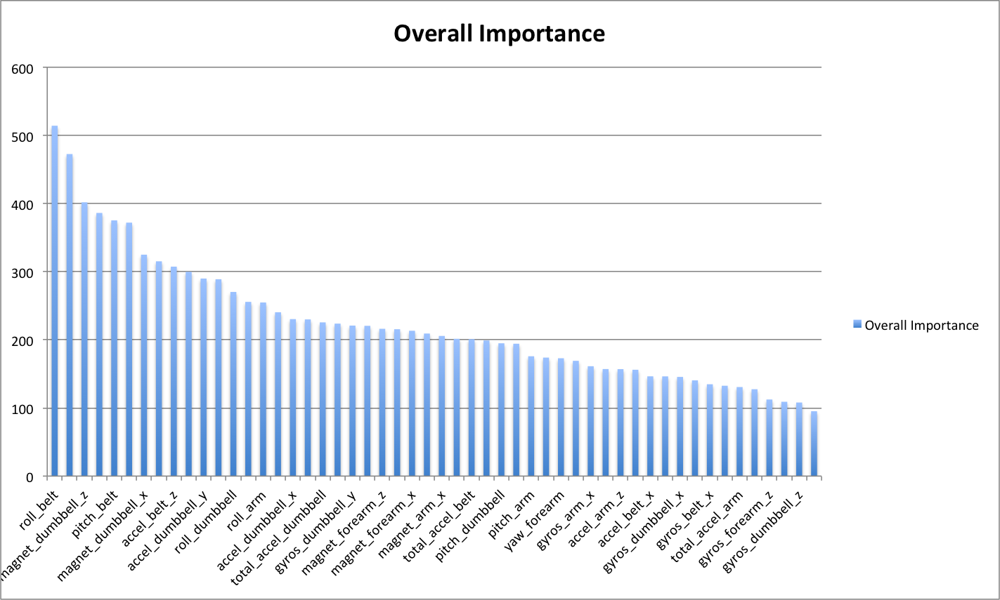

Practical Machine Learning WriteUp
===============================

Author: Zhang Tong <lovewilliam@gmail.com>

1.How you built your model
---------------------------
##1.1 Preprocess data##
open the ``pml-training.csv'' to examine raw data.

extract header names using following shell command

```sh
sh ~ # head -n1 pml-training.csv
"","user_name","raw_timestamp_part_1","raw_timestamp_part_2","cvtd_timestamp",...,"classe"
```

- noticed the 1st column contains index which is useless, so we omit it.
- noticed the 2rd column contains username which may be useful, but I think to grade human activity, there must be some rules that work on all people not just one specific person. So, just omit it to test. If it doesn't work, then we will check it later.
- noticed there are some time stamp columns which I think is obviously useless to determine whether the activity is good or not. Just ignore these columns.
- noticed there are lots of **no** in column `new_window` so it is not suitable for prediction. `num_window` is also obviously have nothing to do with `classe` for ABCDE are distributed evenly on `num_window` range.
- columns contain **NaN** and **empty** values will not contribute to the model.
- row with col `new_window==yes` only count up to 406 items which is a small number compared to all item count 19622. I treat these rows as special rows and negeleted them.

the final columns are 
```
col_names<-c("roll_belt", "pitch_belt", "yaw_belt", "total_accel_belt",
			"gyros_belt_x", "gyros_belt_y", "gyros_belt_z",
			"accel_belt_x",	"accel_belt_y", "accel_belt_z",
			"magnet_belt_x", "magnet_belt_y", "magnet_belt_z",
			"roll_arm",	"pitch_arm", "yaw_arm",	"total_accel_arm",
			"gyros_arm_x", "gyros_arm_y", "gyros_arm_z",
			"accel_arm_x", "accel_arm_y", "accel_arm_z",
			"magnet_arm_x", "magnet_arm_y",	"magnet_arm_z",
			"roll_dumbbell", "pitch_dumbbell", "yaw_dumbbell", "total_accel_dumbbell",
			"gyros_dumbbell_x",	"gyros_dumbbell_y",	"gyros_dumbbell_z",
			"accel_dumbbell_x",	"accel_dumbbell_y",	"accel_dumbbell_z",
			"magnet_dumbbell_x","magnet_dumbbell_y","magnet_dumbbell_z",
			"roll_forearm","pitch_forearm","yaw_forearm", "total_accel_forearm",
			"gyros_forearm_x","gyros_forearm_y","gyros_forearm_z",
			"accel_forearm_x","accel_forearm_y","accel_forearm_z",
			"magnet_forearm_x","magnet_forearm_y","magnet_forearm_z",
			"classe")
```

The column names for test data set are `col_names` without `classe`.

##1.2 Split Data##
Split data into train and validation partition for we already have test data.

##1.3 Reduce Dimension##
To make the training process runs faster, it's better to reduce dimension of the data using PCA. As I see there may be some redundant columns such as `total_accel*` that may be the abs value of sum of vector `accel*`. So the matrix may be not be a full rank matrix.

There are 53 columns in preprocesses data. That's way too much I think. Using PCA to achieve thresh=0.99 we got 36 components. About 32% of the data are removed.


##1.4 Train Model##

As I observed, to determine whether an action is good or not which follows a decision-tree like pattern.

>1.Stand in front of a loaded barbell.  
>2.While keeping the back as straight as possible, bend your knees, bend forward and grasp the bar using a medium (shoulder width) overhand grip. This will be the starting position of the exercise. Tip: If it is difficult to hold on to the bar with this grip, alternate your grip or use wrist straps.  
>3.While holding the bar, start the lift by pushing with your legs while simultaneously getting your torso to the upright position as you breathe out. In the upright position, stick your chest out and contract the back by bringing the shoulder blades back. Think of how the soldiers in the military look when they are in standing in attention.  
>4.Go back to the starting position by bending at the knees while simultaneously leaning the torso forward at the waist while keeping the back straight. When the weights on the bar touch the floor you are back at the starting position and ready to perform another repetition.
Perform the amount of repetitions prescribed in the program.  
>  
>From: http://www.bodybuilding.com/exercises/detail/view/name/barbell-deadlift


So I choose `randomForest` to get the decision tree.

##1.5 Speed up training speed using Multi-core##

I tested a small part of training data first to get better know of the model. I found that the training speed is very slow. About 1 hour on my CPU using 1 core. I decided to speed up using multi-core by using library doMC.

After using doMC on 4 cores, time used by train on full-sized `traing_data` reduced to about 17 min.

##1.6 Result##
When using PCA=0.99 and randomForest we got 1.92% error rate.

```
> fit_rf$finalModel

Call:
 randomForest(x = x, y = y, mtry = param$mtry)
               Type of random forest: classification
                     Number of trees: 500
No. of variables tried at each split: 2

        OOB estimate of  error rate: 1.92%
Confusion matrix:
     A    B    C    D    E class.error
A 4175    5    1    2    2 0.002389486
B   59 2764   24    0    1 0.029494382
C    2   36 2517   11    1 0.019477990
D    1    0   90 2315    6 0.040215589
E    2    6   20   13 2665 0.015151515
>
```

NO PCA, use only randomForest: we got 0.7% error rate.
```
> fit$finalModel

Call:
 randomForest(x = x, y = y, mtry = param$mtry)
               Type of random forest: classification
                     Number of trees: 500
No. of variables tried at each split: 2

        OOB estimate of  error rate: 0.7%
Confusion matrix:
     A    B    C    D    E  class.error
A 4183    1    0    0    1 0.0004778973
B   21 2818    9    0    0 0.0105337079
C    0   20 2545    2    0 0.0085703155
D    0    0   41 2368    3 0.0182421227
E    0    0    1    4 2701 0.0018477458
>
```



I think that is good enough for prediction.

2.How you used cross validation 
-------------------------------
I partitioned original training data as following: 3/4 training, 1/4 validation.

I predicted outcome using validation data using trained model. And I checked error rate of the validation data set. I think the error rate is in an acceptable range. So I just predicted outcome on test dataset. And got:

```
B A B A A E D B A A B C B A E E A B B B
```

3.What you think the expected out of sample error is  
----------------------------------------------------
I think the obvious error is misclassification.

